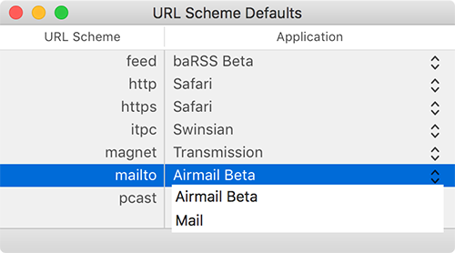

URL Scheme Defaults
===================

Simple tool to change the default macOS application for a given URL scheme (`http:`, `feed:`, etc.). The latter scheme is used for feed reader like [baRSS][1].

Usage
-----

1. Go to [releases][2] and download the tool
2. Run `URL Scheme Defaults`
3. It will list all schemes, for which **more than one** suitable application exists
4. Click on the drop-down icon and select a new application

[1]: https://github.com/relikd/baRSS
[2]: https://github.com/relikd/URL-Scheme-Defaults/releases/latest