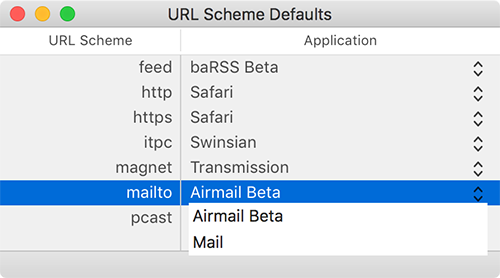

[](#)
[](https://github.com/relikd/URL-Scheme-Defaults/releases/latest)
[](https://github.com/relikd/URL-Scheme-Defaults/releases)


URL Scheme Defaults
===================

Simple tool to change the default macOS application for a given URL scheme (`http:`, `feed:`, etc.).
... or **disable** a URL scheme.




Installation
------------

Requires macOS Yosemite (10.10) or higher.

```sh
brew install --cask relikd/tap/url-scheme-defaults
xattr -d com.apple.quarantine "/Applications/URL Scheme Defaults.app"
```

or download from [releases](https://github.com/relikd/URL-Scheme-Defaults/releases/latest).
